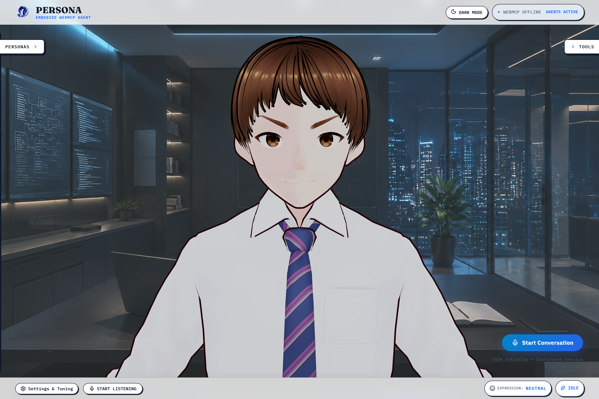
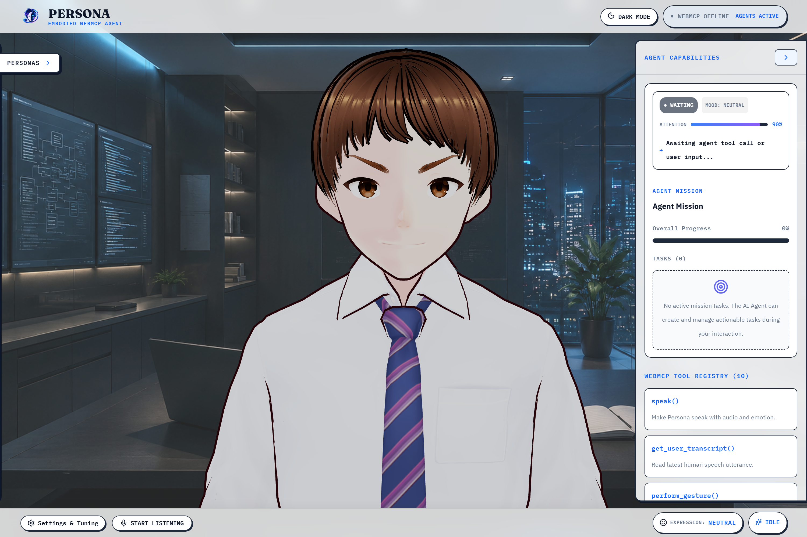

# Persona — The Embodied WebMCP AI Agent

> An embodied browser interface for AI agents — giving them a way to listen, act, speak, look, react, and manage structured task missions on the web through WebMCP.

[WebMCP Specification](docs/WEBMCP.md) | [Architecture Overview](docs/ARCHITECTURE.md) | [Judge Testing Guide](docs/JUDGE_TESTING.md) | [Mock Agent Guide](docs/MOCK_AGENT_TESTING.md)



---

## 1. What is Persona?

Persona is a browser-native embodied interface for AI agents, built specifically for the **WebMCP Challenge**.

While AI agents have become highly capable of reasoning and executing actions, virtually all human-agent interaction remains flattened into plain text chat boxes. Persona explores a different paradigm: **What happens when an AI agent has a digital body and a structured web workspace?**

In Persona:
- The **web page is the agent's body and workspace**.
- A **3D VRM avatar** provides real-time voice, facial expressions, gaze control, and physical gestures.
- An **agent mission task store** provides structured work planning, task tracking, and formatted result presentation.
- The AI agent interacts with the browser exclusively through structured **WebMCP tools** exposed via `document.modelContext`.

### The Core Paradigm Shift

```
Traditional AI Interface:
Human  ──►  Text Box  ──►  AI Agent  ──►  Text Output

Persona Embodied Interface:
Human Intent  ──►  Agent Reasoning  ──►  WebMCP Capabilities  ──►  Application State & 3D Embodiment  ──►  Human Perception
```

The webpage is not being visually operated or scraped by an AI agent. Instead, the webpage exposes typed, discoverable capabilities. The agent decides what actions to take, and Persona renders the physical, spoken, and visual responses in real time.

---

## 2. WebMCP: The Technical Center

WebMCP (`document.modelContext`) is the technical bridge connecting the AI agent's reasoning to the browser environment. Without WebMCP, an agent is isolated behind text; with WebMCP, the agent gains a typed, inspectable action and perception surface.

Persona exposes **10 structured tools** directly on `document.modelContext` (implemented in [`src/webmcp/registerTools.ts`](src/webmcp/registerTools.ts)):

### WebMCP Registered Tools Reference

| Tool Name | Type / Hint | Key Parameters | Purpose & Effect | Controlled System |
|---|---|---|---|---|
| `get_user_transcript` | `readOnlyHint: true` | *None* | Retrieves the latest human speech utterance captured by speech-to-text. | Agent Perception / STT |
| `speak` | Action | `text` (string), `emotion` (enum) | Speaks dialogue aloud using browser TTS while animating mouth and blending facial expression. | Avatar Voice & Expression |
| `set_expression` | Action | `expression` (enum: `neutral`, `warm`, `skeptical`, `impressed`, `stern`, `concerned`, `surprised`, `thinking`) | Smoothly transitions the VRM facial morph targets to a target emotional state. | VRM Morph Targets |
| `perform_gesture` | Action | `gesture` (enum: `nod`, `shake_head`, `head_tilt`, `acknowledge`, `agree`, `disagree`, `thinking`, `lean_forward`, `lean_back`, `shrug`) | Triggers procedural skeletal body and head animations. | 3D Bone / Pose Animation |
| `set_attention` | Action | `target` (enum: `user`, `center`, `away`) | Directs the avatar's head orientation and gaze tracking. | Gaze & Attention System |
| `create_task` | Action | `title` (string), `description` (optional), `priority` (`low`/`medium`/`high`) | Creates a new actionable item in the active agent mission list. | Task / Mission System |
| `update_task` | Action | `taskId` (string), `title`, `description`, `priority`, `status` (`pending`/`in_progress`/`completed`/`cancelled`) | Updates title, description, priority, or execution status of an existing task. | Task / Mission System |
| `get_tasks` | `readOnlyHint: true` | `statusFilter` (`all`, `pending`, `in_progress`, `completed`, `cancelled`) | Reads current mission tasks filtered by status. | Task / Mission System |
| `complete_task` | Action | `taskId` (string) | Shortcut tool to mark a specific task as completed. | Task / Mission System |
| `show_result` | Action | `title` (string), `summary` (string), `data` (JSON object), `type` (`info`/`success`/`warning`/`error`) | Displays a structured result summary card with optional key-value payload in the UI. | Agent Result UI Card |



---

## 3. Human + Agent Interaction Loop

Persona establishes a clean, continuous loop between human intent and agent action:

1. **Human Intent**: The human speaks naturally into their microphone.
2. **Speech Perception**: Persona's speech-to-text engine (`SpeechRecognizer`) converts spoken audio into text and buffers it.
3. **Agent Observation**: The external AI agent polls or calls `get_user_transcript` to read the human input.
4. **Agent Decision**: The agent reasons about the input and decides on a sequence of tool calls (e.g., set expression to `thinking`, direct gaze `away`, create a task, speak a response).
5. **WebMCP Execution**: Persona executes each tool call against its internal React state, 3D VRM runtime, and voice synthesis engine.
6. **Embodied Response**: The avatar speaks aloud, nods/gestures, shifts gaze back to `user`, updates task progress, and presents formatted results.
7. **Turn-Taking**: Once speech synthesis finishes, speech recognition resumes automatically for the human's next turn.

---

## 4. 3D VRM Avatar Embodiment

Persona renders custom 3D VRM 1.0 models using Three.js and `@pixiv/three-vrm`. The avatar is not a passive video loop; it is a live 3D web runtime ([`src/avatar/PersonaAvatarRuntime.ts`](src/avatar/PersonaAvatarRuntime.ts)).

### Key Embodiment Subsystems

- **VRM 1.0 Morph Target Expressions**: 8 distinct emotional profiles (`neutral`, `warm`, `skeptical`, `impressed`, `stern`, `concerned`, `surprised`, `thinking`). Smoothly blended via frame-by-frame delta interpolation ([`src/avatar/expression/vrmExpressionAdapter.ts`](src/avatar/expression/vrmExpressionAdapter.ts)).
- **Procedural Gaze Tracking**: Dynamic eye and head rotation system targeting `user` (direct eye contact), `center` (neutral forward), or `away` (thoughtful glance) ([`src/avatar/gaze.ts`](src/avatar/gaze.ts)).
- **Procedural Skeletal Gestures**: Real-time bone manipulation for gestures including `nod`, `shake_head`, `head_tilt`, `acknowledge`, `agree`, `disagree`, `thinking`, `lean_forward`, `lean_back`, and `shrug` ([`src/avatar/animation/gestures.ts`](src/avatar/animation/gestures.ts)).
- **Humanization & Idle Engine**: Continuous micro-movements including natural breathing cycles, organic blink frequencies, and subtle posture shifts to eliminate stiffness ([`src/avatar/behavior/humanizationEngine.ts`](src/avatar/behavior/humanizationEngine.ts)).
- **Multi-Persona Profiles**: 
  - **Alex** (Technical Interviewer — `/models/Alex0.1.vrm`)
  - **Ken** (Language Coach — `/models/Ken0.1.vrm`)
  - **Steve** (Presentation Coach — `/models/steve0.1.vrm`)
  - **Harry** (Debate Partner — `/models/Harry0.1.vrm`)
- **2D Canvas/SVG Fallback**: Lightweight 2D avatar alternative ([`src/components/Avatar2D.tsx`](src/components/Avatar2D.tsx)) for environments without WebGL hardware acceleration.

---

## 5. Voice & Speech Subsystem

Persona's voice capabilities rely entirely on standard browser Web APIs for low latency and zero backend overhead ([`src/voice/BrowserVoiceEngine.ts`](src/voice/BrowserVoiceEngine.ts) and [`src/utils/stt.ts`](src/utils/stt.ts)).

- **Speech-to-Text (STT)**: Implemented via browser `SpeechRecognition` / `webkitSpeechRecognition`. Handles real-time interim speech transcription and utterance isolation.
- **Text-to-Speech (TTS)**: Implemented via `SpeechSynthesis` and `SpeechSynthesisUtterance`. Uses a gender-aware voice selection heuristic (matching persona preferences to system voices like Microsoft Guy/Jenny or Google US English).
- **Emotion Modulation**: Adjusts speech pitch and playback rate dynamically based on the requested emotion (e.g., `warm` increases pitch slightly, `stern` lowers pitch and rate).
- **Mouth Lip Sync Approximation**: Simulates lip-flap amplitude during active TTS playback.
- **Interruption Management & Feedback Loop Guard**: STT automatically pauses during avatar speech playback to prevent self-transcription. If the human speaks while the avatar is talking, TTS cancels immediately and returns control to the human.

---

## 6. Structured Task & Mission System

To prevent interactions from devolving into unstructured chat, Persona includes a reactive task state engine ([`src/tasks/taskStore.ts`](src/tasks/taskStore.ts)).

AI agents can manage complex multi-step workflows using the task tools:

- **Create Work**: `create_task({ title: "Assess Machine Learning Fundamentals", priority: "high" })`
- **Track Progress**: `update_task({ taskId: "task_1", status: "in_progress" })`
- **Read State**: `get_tasks({ statusFilter: "pending" })`
- **Present Outcomes**: `show_result({ title: "Interview Roadmap", summary: "Focusing on System Design...", data: { topics: ["Distributed Systems", "Caching"] }, type: "info" })`

The UI renders an active **Agent Mission Panel** showing progress percentages, task priority badges, and formatted result cards.

---

## 7. Example: Data Science Interview Preparation

Here is a real example of how a WebMCP agent utilizes Persona's tools in practice:

### Initial Request
**Human**: *"Prepare me for a data science technical interview tomorrow."*

**Agent Execution**:
1. `create_task({ title: "Assess Machine Learning Fundamentals", priority: "high" })`
2. `create_task({ title: "Practice Python Data Structures & Pandas", priority: "medium" })`
3. `set_expression({ expression: "thinking" })`
4. `set_attention({ target: "away" })`
5. `speak({ text: "Great! Let's start by breaking down ML fundamentals and coding practice.", emotion: "warm" })`
6. `perform_gesture({ gesture: "nod" })`
7. `set_attention({ target: "user" })`
8. `show_result({ title: "Prep Plan Created", summary: "2 core practice modules queued.", type: "success" })`

### Interactive Requirement Shift
**Human**: *"Actually, let's focus much more on machine learning algorithms."*

**Agent Execution**:
1. `update_task({ taskId: "task_1", priority: "high", description: "Deep dive into model evaluation and gradient boosting" })`
2. `update_task({ taskId: "task_2", status: "cancelled" })`
3. `set_expression({ expression: "impressed" })`
4. `perform_gesture({ gesture: "agree" })`
5. `speak({ text: "Understood. Re-prioritizing our mission around ML algorithms.", emotion: "warm" })`

---

## 8. Tech Stack

Persona is built using a modern, pure browser-native TypeScript stack:

| Category | Technologies | Description |
|---|---|---|
| **Core Framework** | React 19, TypeScript 6, Vite 8 | Fast React SPA frontend with strict type safety. |
| **3D & Avatar** | Three.js (0.185), `@pixiv/three-vrm` (3.5) | Real-time 3D WebGL rendering and VRM 1.0 humanoid avatar control. |
| **Agent Protocol** | WebMCP (`webmcp-types` 0.1.5) | W3C-proposed Web Model Context Protocol for tool exposure via `document.modelContext`. |
| **Voice / Audio** | Web Speech API | Browser-native `SpeechRecognition` (STT) and `SpeechSynthesis` (TTS). |
| **Icons & UI** | Lucide React, Pure CSS3 | Custom glassmorphism aesthetic with light/dark theme support. |

---

## 9. Project Structure

```
persona/
├── public/
│   ├── background/         Persona background images
│   ├── models/             VRM 3D avatar files (Alex0.1.vrm, Ken0.1.vrm, etc.)
│   └── persona.png         Application logo
├── project-media/
│   ├── 01-persona-hero.png Interface hero screenshot
│   └── 02-webmcp-tools.png WebMCP tools visualization
├── src/
│   ├── agent/              Agent adapter interface (production vs dev)
│   ├── avatar/             VRM avatar 3D runtime & subsystems
│   │   ├── animation/      Gestures and idle animation controllers
│   │   ├── behavior/       Humanization engine and micro-reactions
│   │   ├── expression/     VRM morph target adapters & profiles
│   │   ├── gaze.ts         Gaze and attention tracking
│   │   └── PersonaAvatarRuntime.ts Main Three.js/VRM setup
│   ├── components/         React UI components
│   │   ├── AgentMissionPanel.tsx Task mission tracker UI
│   │   ├── Avatar2D.tsx    Fallback 2D avatar renderer
│   │   ├── ConversationControls.tsx Session trigger buttons
│   │   ├── ConversationTranscript.tsx Dialogue transcript log
│   │   ├── ManualControls.tsx Dev/Testing tool triggers
│   │   └── ResultDisplayCard.tsx Task output summary cards
│   ├── config/             Persona definitions (Alex, Ken, Steve, Harry)
│   ├── dev/                Development MockAgent harness & debug console
│   ├── memory/             Session memory state store
│   ├── session/            Conversation session state machine
│   ├── tasks/              Task store & mission state management
│   ├── types/              Shared TypeScript definitions
│   ├── utils/              STT utilities (`stt.ts`)
│   ├── voice/              Browser SpeechSynthesis TTS engine
│   ├── webmcp/             WebMCP tool registration (`registerTools.ts`)
│   ├── App.tsx             Main React application
│   └── main.tsx            App entry point
├── docs/                   Architectural documentation & testing guides
├── package.json            Dependencies and scripts
├── tsconfig.json           TypeScript configuration
├── vite.config.ts          Vite build configuration
└── README.md               Project documentation
```

---

## 10. Setup & Local Development

### Prerequisites

- **Node.js**: v18.0.0 or higher
- **npm**: v9.0.0 or higher
- **Browser**: Google Chrome 131+ (recommended for Web Speech API and WebMCP flag support)

### Installation

```bash
git clone https://github.com/pratik-aher-01/Persona.git
cd persona
npm install
```

### Start Development Server

```bash
npm run dev
```
Open [http://localhost:5173](http://localhost:5173) in your browser.

### Enabling the Mock Agent (Dev Testing Harness)

To test WebMCP tool calls locally without connecting to ChatGPT:

1. Create a `.env` file in the project root:
   ```bash
   VITE_ENABLE_MOCK_AGENT=true
   ```
2. Restart `npm run dev`. A **Mock Agent Console** panel will render at the bottom of the screen, allowing deterministic testing of all 10 WebMCP tools.

### Production Build & Preview

```bash
npm run build
npm run preview
```

---

## 11. Testing Persona with WebMCP

### 1. Enabling WebMCP in Chrome

1. Open `chrome://flags/#enable-webmcp-testing` in Google Chrome.
2. Set the flag to **Enabled**.
3. Relaunch Chrome and navigate to your local or deployed Persona URL.

### 2. Verifying Tools via Console

Open Developer Tools (F12) and inspect registered tools:

```javascript
// Get all registered WebMCP tools
const tools = await document.modelContext.getTools();
console.log(tools.map(t => t.name));
// Output: ['speak', 'get_user_transcript', 'perform_gesture', 'set_expression', 'set_attention', 'create_task', 'update_task', 'get_tasks', 'complete_task', 'show_result']

// Execute a spoken tool call manually
const speakTool = tools.find(t => t.name === 'speak');
await document.modelContext.executeTool(speakTool, JSON.stringify({
  text: "Hello! WebMCP tools are working perfectly.",
  emotion: "warm"
}));
```

For detailed step-by-step judge instructions, see [`docs/JUDGE_TESTING.md`](docs/JUDGE_TESTING.md).

---

## 12. Design Philosophy

> *"An agent should not only have a way to act. It should have a way to communicate what it is doing."*

In traditional software, human interfaces are built for human eyes and hands. In the agentic era, web interfaces must become **bilateral**:
- Structured for **agent perception and control** (via WebMCP).
- Intuitive and natural for **human perception and collaboration** (via voice and 3D embodiment).

Persona demonstrates that embodiment is not cosmetic decoration — it is an active channel through which an AI agent communicates intent, emotional tone, attention, and task status.

---

## 13. Engineering Challenges & Solutions

1. **Audio Feedback Loops**: When TTS plays audio through speakers, STT can hear the avatar and transcribe itself.
   - *Solution*: Implemented explicit mute locks during TTS playback and speech interruption detection.
2. **Browser Voice Variability**: System TTS voices vary wildly across Operating Systems (Windows, macOS, Linux).
   - *Solution*: Designed a deterministic voice selection fallback algorithm that ranks natural English voices by gender preference and quality keywords.
3. **Phoneme-Less Lip Sync**: Web SpeechSynthesis does not expose phoneme timing events.
   - *Solution*: Built an audio-amplitude mouth flap simulation matched to speech duration and speed parameters.
4. **Idempotent WebMCP Tool Registration**: Hot-reloading in Vite can lead to duplicate tool registration errors on `document.modelContext`.
   - *Solution*: Added registration lock guards and graceful duplicate exception handling in `registerWebMcpTools`.

---

## 14. What's Next?

### Currently Implemented
- [x] 10 WebMCP tools registered via `document.modelContext`
- [x] Real-time 3D VRM 1.0 avatar rendering with morph-target blending
- [x] Procedural gaze, gesture, and humanization breathing systems
- [x] Full browser-native STT (SpeechRecognition) & TTS (SpeechSynthesis)
- [x] Structured Task & Mission State Store with progress tracking and result cards
- [x] 4 distinct persona configurations (Alex, Ken, Steve, Harry)
- [x] Lightweight 2D fallback renderer

### Future Roadmap
- [ ] **Socratic Learning Tutor**: Guided concept breakdown with adaptive quiz tasks.
- [ ] **Presentation Rehearsal Analytics**: Pace and filler-word detection during user speeches.
- [ ] **Multimodal Vision Integration**: Giving the avatar visual awareness of the user's camera feed.
- [ ] **Persistent Agent Memory**: Cross-session task history and relationship continuity.

---

## 15. Hackathon Context: WebMCP Challenge

Persona was conceived and developed for the **WebMCP Challenge**.

The project tests a core hypothesis: **WebMCP can transform any browser page into an embodied environment for AI agents.** By standardizing how web applications expose capabilities to LLMs, WebMCP enables a new class of rich, interactive, and human-friendly agent applications.

---

## 16. License

This project is licensed under the [MIT License](LICENSE).
